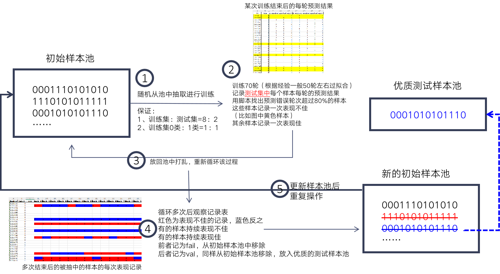
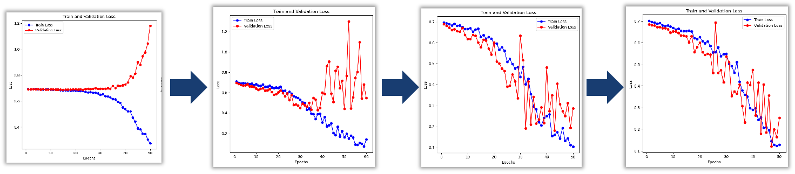

# 项目结构说明

## 1 前期数据整理工作/（均为过程文件可忽略）

### 1.1 表格文件

`第一、二批数据模态统计.xlsx` 内容是对第一、第二批数据（来自2024/11和2024/12）的每一例样本所含有的模态种类、影像获取时间、是否具有mask等进行统计和整理，情况如下：

| modal     | 总数/加上第三行 | 有效个数/加上第三行 | 无效个数/加上第三行 | 两类之比/算上第三行 |
| --------- | --------------- | ------------------- | ------------------- | ------------------- |
| CT+DSA    | 54/67           | 40/50               | 14/17               | 2.85:1/2.94:1       |
| MR+DSA    | 31/44           | 18/28               | 13/16               | 1.38:1/1.75:1       |
| MR+CT+DSA | 13              | 10                  | 3                   | 3.33:1              |
| MR        | 3               | 2                   | 1                   | 2:1                 |
| DSA       | 12              | 12                  | 0                   | 12:0                |
| TOTAL     | 113             | 82                  | 31                  | 2.64:1              |

选择CT+DSA组合，第三批数据（来自2025/4）加入后，经过初步筛选情况如下：

| modal  | 总数 | 有效个数 | 无效个数 |
| ------ | ---- | -------- | -------- |
| CT+DSA | 284  | 169      | 115      |

### 1.2 批量处理的功能代码

`move.py等` 均为自动化批量整理、处理数据的代码。如：查漏（有些样本某些模态的文件夹是空的）、样本文件夹命名统一、将CT的静脉期文件（也就是P、A、V、D里的A）筛选出来等等。

由于该过程为较早期的工作，大部分代码已丢失。

## 2 raw_data/

原始影像数据，以下两个文件夹为真正使用的数据：

`raw_data/CT_nii/` 存放梳理后的nii格式的CT影像

`raw_data/DSA/` 存放裁剪成一致大小后的DSA影像数据

另外还有按模态类别整理好的未使用的数据：

`MR+CT+DSA/`、`MR+DSA/`

## 3 pretrain/

针对两种模态的预训练相关流程

### 3.1 pretrain/data

与训练数据相关模块

- data/datasets：数据集定义模块，`ct_dataset.py`和`dsa_dataset.py`分别处理两种模态
- data/features：特征相关目录，`features_ct/`和`features_dsa_resnet/`分别对应两种模态，如`features_ct/0000283545.pt`对应编号为0000283545的患者的CT数据特征

### 3.2 pretrain/models

预训练模型定义模块

### 3.3 pretrain/outputs

预训练输出结果目录

### 3.4 pretrain/scripts

预训练脚本模块

`mae_ct_pretrain.py`、`mae_dsa_pretrain.py`、`resnet_dsa_pretrain.py` 分别执行对应模型在 CT、DSA 数据上的预训练流程；`feature_ct_extract.py`、`feature_dsa_extract.py` 用于从 CT、DSA 影像中提取特征，为下游任务准备输入


`main.py` 为预训练的功能主脚本，使用时：

```bash
cd pretrain
python main.py pretrain_ct # 针对CT数据进行预训练
python main.py pretrain_dsa # 针对DSA数据进行预训练
```

## 4 models/

下游任务的深度学习模型定义相关代码

## 5 filter/

该文件夹存放的主要是有关数据筛选的代码和文件

### 5.1 筛选方案



### 5.2 筛选效果



### 5.3 filter/val_result.xlsx

筛选过程中留出法抽取8：1训练集与验证集在100轮中的预测结果

## 6 label.xlsx

参与筛选的所有样本的label与筛选结果

符号与标记解释：

- `*` 代表在留出法某次随机抽取中被抽为验证集，并在100轮训练过程中正确轮数超过60%，表现为符合规律的一次
- `#`代表在留出法某次随机抽取中被抽为验证集，并在100轮训练过程中正确轮数低于60%，表现为不符合规律的一次
- `fail`代表连续被标记为`#`超过5次，认为是不适合当前模型所拟合出的模态的样本，将不参与训练和测试
- `val`代表连续被标记为`*`超过5次，认为是适合当前模型拟合出的模态的样本，将作为验证集参与训练
- `空白`代表未被抽中或表现不稳定，将作为候选的训练样本

## 7 train_val.ipynb

交互式notebook实现模型训练、验证与可视化过程

## 8 result.xlsx

训练过程记录，`sheet=train`为训练集，`sheet=val`为验证集

# 结果

- 验证集15个1类，11个0类

- 准确率： 0.903±0.054


